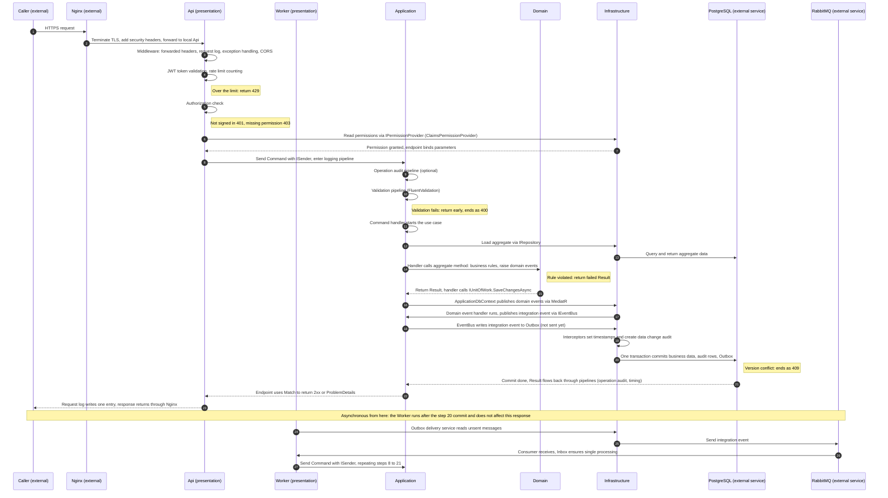
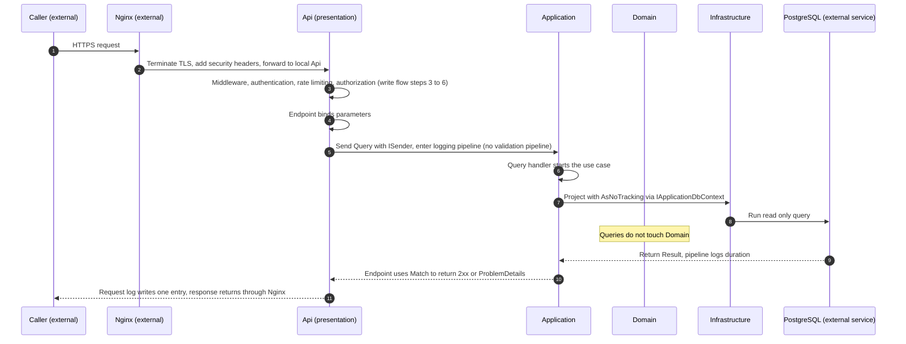

# 3. Layers and dependency direction \{#3-layers-and-dependency-direction\}

The system has four conceptual layers:

1. **Domain**: core business rules; depends on no other layer.
2. **Application**: orchestrates use cases; depends only on Domain.
3. **Infrastructure**: implements the interfaces Application defines and handles technical details such as the database and external services.
4. **Presentation**: entry points, namely the Api plus an optional Worker.

Dependency rules:

- Domain references no project.
- Application references only Domain.
- Infrastructure references Application (and Domain through it).
- Api and Worker reference Application and Infrastructure; the Infrastructure reference **exists only to register dependency injection in `Program.cs`** (the composition root), and business code never calls Infrastructure directly.

The benefit: Domain and Application can be fully tested without a database, web server or framework.

**Layers and vertical slices**

Clean Architecture decides **vertical** dependencies: which layer may reference which. Vertical Slice decides organisation **within each layer**: Application, Api, Worker and tests all use "feature, then use case" folders, keeping every file for one use case together, and the folder structures of the layers mirror each other. Domain is organised by aggregate and Infrastructure by technical concern. See [8.15](./08-design-rules/15-feature-slices-vertical-slice.mdx).

**Request flow**

The two Mermaid sequence diagrams below show which layers a request passes through: each vertical line is a layer (or an external service), each arrow is one step, and the column an arrow points to is the layer where that step happens. The numbers on the arrows match the tables below the diagrams. The notes show where a request can be rejected. GitHub, GitLab, Azure DevOps, VS Code and Rider all render Mermaid.

**Write request (Command)**

| Step | Layer | What happens | Section or location |
| --- | --- | --- | --- |
| 1 | External | Caller sends an HTTPS request | None |
| 2 | External | Nginx terminates TLS, adds security headers and forwards to the local Api | [12.8](../code/12-solution-level.mdx#12-8-deploy-nginx-productname-api-conf) |
| 3 | Api | Middleware: forwarded headers, request log timer starts, exception handling, CORS | [16.13](../code/16-api.mdx#16-13-program-cs) |
| 4 | Api | JWT Bearer validates the token; rate limiting counts per user or IP and returns 429 when exceeded | [16.7](../code/16-api.mdx#16-7-authextensions-cs), [16.11](../code/16-api.mdx#16-11-ratelimitingextensions-cs) |
| 5 | Api | Authorization: 401 when not signed in; 403 when the endpoint's permission is missing | [16.8](../code/16-api.mdx#16-8-permissionrequirement-cs) to [16.10](../code/16-api.mdx#16-10-permissionendpointextensions-cs) |
| 6 | Infrastructure | `ClaimsPermissionProvider` reads permissions from the token (the Api calls it through Application's `IPermissionProvider` interface) | [14.13](../code/14-application.mdx#14-13-ipermissionprovider-cs), [15.7](../code/15-infrastructure.mdx#15-7-claimspermissionprovider-cs) |
| 7 | Api | Endpoint binds parameters and sends the Command with `ISender` | `Endpoints/{Feature}/{UseCase}.cs`, [16.1](../code/16-api.mdx#16-1-iendpoint-cs), [16.2](../code/16-api.mdx#16-2-endpointextensions-cs) |
| 8 | Application | Logging pipeline starts timing; every log entry carries `RequestName` | [14.8](../code/14-application.mdx#14-8-loggingpipelinebehavior-cs) |
| 9 | Application | Operation audit pipeline (optional) waits for the outcome | [14.19](../code/14-application.mdx#14-19-operationauditpipelinebehavior-cs-optional-auditing) |
| 10 | Application | Validation pipeline runs FluentValidation; on failure it returns a failed Result, which ends as 400 | [14.9](../code/14-application.mdx#14-9-validationpipelinebehavior-cs) |
| 11 | Application | Command handler starts the use case | `Features/{Feature}/{UseCase}/` |
| 12 | Infrastructure | Repository loads the aggregate with `ApplicationDbContext` (the handler calls it through Domain's repository interface) | [13.6](../code/13-domain.mdx#13-6-irepository-cs), [15.4](../code/15-infrastructure.mdx#15-4-repository-cs) |
| 13 | External | PostgreSQL returns the aggregate data | None |
| 14 | Domain | Handler calls the aggregate method: business rules, state change, domain events; a rule violation returns a failed Result | [13.3](../code/13-domain.mdx#13-3-aggregateroot-cs), [13.11](../code/13-domain.mdx#13-11-result-cs-and-iresultfactory-cs) |
| 15 | Application | Handler calls `IUnitOfWork.SaveChangesAsync` | [14.11](../code/14-application.mdx#14-11-iunitofwork-cs) |
| 16 | Infrastructure | Before writing, `ApplicationDbContext` publishes domain events through MediatR | [15.1](../code/15-infrastructure.mdx#15-1-applicationdbcontext-cs) |
| 17 | Application | Domain event handlers run; when the outside world must be told, they publish an integration event through `IEventBus` | [14.6](../code/14-application.mdx#14-6-idomaineventhandler-cs), [14.7](../code/14-application.mdx#14-7-ieventbus-cs) |
| 18 | Infrastructure | `EventBus` (MassTransit) writes the integration event to the Outbox; nothing is sent yet | [15.5](../code/15-infrastructure.mdx#15-5-eventbus-cs), [15.8](../code/15-infrastructure.mdx#15-8-dependencyinjection-cs) |
| 19 | Infrastructure | Interceptors set `CreatedAt` and `UpdatedAt` and create data change audit rows | [15.3](../code/15-infrastructure.mdx#15-3-timestampsinterceptor-cs), [15.13](../code/15-infrastructure.mdx#15-13-audittrailinterceptor-cs-optional-auditing) |
| 20 | External | PostgreSQL commits business data, audit rows and Outbox messages in one transaction; a version conflict throws and ends as 409 | [8.17](./08-design-rules/17-concurrency-control.mdx) |
| 21 | Application | Result flows back through the pipelines: operation audit written, duration logged | [14.8](../code/14-application.mdx#14-8-loggingpipelinebehavior-cs), [14.19](../code/14-application.mdx#14-19-operationauditpipelinebehavior-cs-optional-auditing), [15.14](../code/15-infrastructure.mdx#15-14-operationauditwriter-cs-optional-auditing) |
| 22 | Api | Endpoint converts with `Match`: success becomes 2xx, failure becomes ProblemDetails via `CustomResults`; unhandled exceptions become 409 or 500 via `GlobalExceptionHandler` | [16.3](../code/16-api.mdx#16-3-resultextensions-cs), [16.5](../code/16-api.mdx#16-5-customresults-cs), [16.6](../code/16-api.mdx#16-6-globalexceptionhandler-cs) |
| 23 | External | Request log writes one entry (path, status code, duration, `UserId`) and the response returns through Nginx | [16.13](../code/16-api.mdx#16-13-program-cs) |
| 24 | Infrastructure | (Async) The Outbox delivery service in the Worker reads unsent messages | [15.8](../code/15-infrastructure.mdx#15-8-dependencyinjection-cs), [17.2](../code/17-worker-optional.mdx#17-2-program-cs) |
| 25 | External | RabbitMQ carries the integration event | External services list in section [2](./02-technical-baseline.mdx) |
| 26 | Worker | Consumer receives the message; the Inbox ensures each message is processed once | [17.2](../code/17-worker-optional.mdx#17-2-program-cs) |
| 27 | Application | Consumer sends a Command with `ISender`, repeating steps 8 to 21 | [8.4](./08-design-rules/04-masstransit-async-messaging.mdx) |

- Steps 6, 12, 16, 18 and 19 run in Infrastructure, yet Application and Api only know interfaces (`IPermissionProvider`, `IRepository`, `IUnitOfWork`, `IEventBus`) and never reference Infrastructure classes. That is exactly the dependency rule of section 3.
- Domain appears only at step 14: all business rules live in aggregates, and no other layer writes business rules.
- Steps 24 to 27 are asynchronous; the Worker runs them after the step 20 commit, so they do not affect this response's speed or result.

**Read request (Query)**

| Step | Layer | What happens | Section or location |
| --- | --- | --- | --- |
| 1 | External | Caller sends an HTTPS request | None |
| 2 | External | Nginx terminates TLS, adds security headers and forwards to the local Api | [12.8](../code/12-solution-level.mdx#12-8-deploy-nginx-productname-api-conf) |
| 3 | Api | Middleware, authentication, rate limiting and authorization, same as write flow steps 3 to 6 | [16.13](../code/16-api.mdx#16-13-program-cs) |
| 4 | Api | Endpoint binds parameters and sends the Query with `ISender` | `Endpoints/{Feature}/{UseCase}.cs` |
| 5 | Application | Logging pipeline; the operation audit pipeline when the request implements `IAuditableRequest`; the validation pipeline applies only to Commands | [14.1](../code/14-application.mdx#14-1-ibasecommand-cs), [14.8](../code/14-application.mdx#14-8-loggingpipelinebehavior-cs), [14.19](../code/14-application.mdx#14-19-operationauditpipelinebehavior-cs-optional-auditing) |
| 6 | Application | Query handler starts the use case | `Features/{Feature}/{UseCase}/` |
| 7 | Infrastructure | Projects straight to the Response with `AsNoTracking` through `IApplicationDbContext`, without loading an aggregate | [14.10](../code/14-application.mdx#14-10-iapplicationdbcontext-cs), [15.1](../code/15-infrastructure.mdx#15-1-applicationdbcontext-cs) |
| 8 | External | PostgreSQL runs the read only query | None |
| 9 | Application | Returns `Result<Response>`; the pipeline logs duration | [14.8](../code/14-application.mdx#14-8-loggingpipelinebehavior-cs) |
| 10 | Api | Endpoint uses `Match` to return 2xx or ProblemDetails | [16.3](../code/16-api.mdx#16-3-resultextensions-cs), [16.5](../code/16-api.mdx#16-5-customresults-cs) |
| 11 | External | Request log writes one entry and the response returns through Nginx | [16.13](../code/16-api.mdx#16-13-program-cs) |

- Queries touch neither Domain nor repositories: no aggregate is loaded and nothing is modified; they project straight to the needed columns (see [8.1](./08-design-rules/01-cqrs-read-and-write-separation.mdx)).
