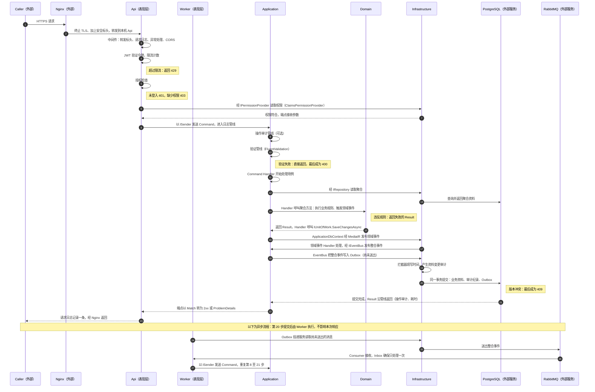
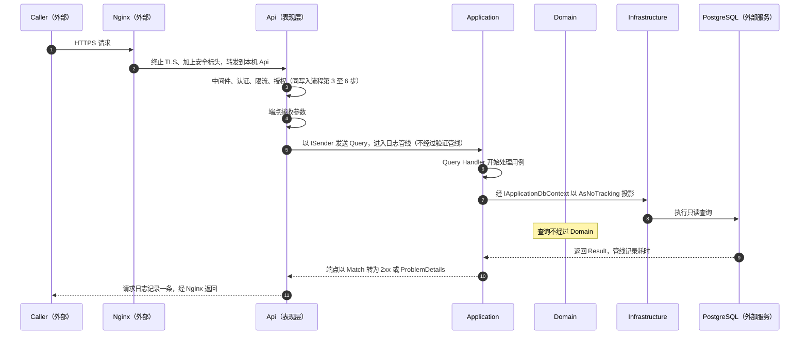

# 3. 分层与依赖方向 \{#3-layers-and-dependency-direction\}

系统分为四个概念层：

1. **Domain（领域层）**：核心业务规则，不依赖任何其他层。
2. **Application（应用层）**：用例编排，只依赖 Domain。
3. **Infrastructure（基础设施层）**：实现 Application 定义的接口，负责数据库、外部服务等技术细节。
4. **Presentation（表现层）**：系统入口，包括 Api，以及按需加入的 Worker。

依赖规则：

- Domain 不引用任何项目。
- Application 只引用 Domain。
- Infrastructure 引用 Application（间接引用 Domain）。
- Api 与 Worker 引用 Application 和 Infrastructure；引用 Infrastructure **只用于在 `Program.cs` 中注册依赖注入**（Composition Root），业务代码不直接调用 Infrastructure。

这样安排的好处是：Domain 与 Application 可以在没有数据库、Web 服务器或框架的情况下完整测试。

**分层与功能切片的关系**

Clean Architecture 决定**垂直方向**的依赖：哪一层可以引用哪一层。Vertical Slice 决定**每一层之内**的组织方式：Application、Api、Worker 与测试都以“功能 → 用例”分资料夹，一个用例的所有相关文件放在一起，各层的资料夹结构互相对应。Domain 按聚合组织，Infrastructure 按技术关注点组织。详见 [8.15](./08-design-rules/15-feature-slices-vertical-slice.mdx)。

**请求处理流程**

以下两张图以 Mermaid 时序图显示一个请求经过哪些层：每一条直线是一层（或一个外部服务），每个箭头是一个步骤，箭头指向的那一栏就是该步骤发生的层；箭头上的编号对应图下的表格。黄色注记标出请求在哪一步被拒绝。GitHub、GitLab、Azure DevOps、VS Code 与 Rider 都能直接显示 Mermaid。

**写入请求（Command）**

| 步骤 | 经过的层 | 发生什么 | 对应章节或位置 |
| --- | --- | --- | --- |
| 1 | 外部 | Caller 发出 HTTPS 请求 | 无 |
| 2 | 外部 | Nginx 终止 TLS、加上安全标头，转发到本机的 Api | [12.8](../code/12-solution-level.mdx#12-8-deploy-nginx-productname-api-conf) |
| 3 | Api | 中间件：转发标头、请求日志开始计时、异常处理、CORS | [16.13](../code/16-api.mdx#16-13-program-cs) |
| 4 | Api | JWT Bearer 验证令牌；限流按使用者或 IP 计数，超过返回 429 | [16.7](../code/16-api.mdx#16-7-authextensions-cs)、[16.11](../code/16-api.mdx#16-11-ratelimitingextensions-cs) |
| 5 | Api | 授权：未登入返回 401；缺少端点要求的权限返回 403 | [16.8](../code/16-api.mdx#16-8-permissionrequirement-cs) 至 [16.10](../code/16-api.mdx#16-10-permissionendpointextensions-cs) |
| 6 | Infrastructure | `ClaimsPermissionProvider` 从令牌读取权限（Api 经由 Application 的 `IPermissionProvider` 介面呼叫） | [14.13](../code/14-application.mdx#14-13-ipermissionprovider-cs)、[15.7](../code/15-infrastructure.mdx#15-7-claimspermissionprovider-cs) |
| 7 | Api | 端点接收参数，以 `ISender` 发送 Command | `Endpoints/{功能}/{用例}.cs`，[16.1](../code/16-api.mdx#16-1-iendpoint-cs)、[16.2](../code/16-api.mdx#16-2-endpointextensions-cs) |
| 8 | Application | 日志管线开始计时，所有日志带上 `RequestName` | [14.8](../code/14-application.mdx#14-8-loggingpipelinebehavior-cs) |
| 9 | Application | 操作审计管线（可选）等待执行结果 | [14.19](../code/14-application.mdx#14-19-operationauditpipelinebehavior-cs-optional-auditing) |
| 10 | Application | 验证管线执行 FluentValidation；失败时直接返回失败的 Result，最后成为 400 | [14.9](../code/14-application.mdx#14-9-validationpipelinebehavior-cs) |
| 11 | Application | Command Handler 开始处理用例 | `Features/{功能}/{用例}/` |
| 12 | Infrastructure | 仓储以 `ApplicationDbContext` 读取聚合（Handler 经由 Domain 的仓储介面呼叫） | [13.6](../code/13-domain.mdx#13-6-irepository-cs)、[15.4](../code/15-infrastructure.mdx#15-4-repository-cs) |
| 13 | 外部 | PostgreSQL 返回聚合资料 | 无 |
| 14 | Domain | Handler 呼叫聚合方法：执行业务规则、修改状态、触发领域事件；违反规则时返回失败的 Result | [13.3](../code/13-domain.mdx#13-3-aggregateroot-cs)、[13.11](../code/13-domain.mdx#13-11-result-cs-and-iresultfactory-cs) |
| 15 | Application | Handler 呼叫 `IUnitOfWork.SaveChangesAsync` | [14.11](../code/14-application.mdx#14-11-iunitofwork-cs) |
| 16 | Infrastructure | `ApplicationDbContext` 在写入前，经 MediatR 发布领域事件 | [15.1](../code/15-infrastructure.mdx#15-1-applicationdbcontext-cs) |
| 17 | Application | 领域事件 Handler 处理事件；需要通知外部时，经 `IEventBus` 发布整合事件 | [14.6](../code/14-application.mdx#14-6-idomaineventhandler-cs)、[14.7](../code/14-application.mdx#14-7-ieventbus-cs) |
| 18 | Infrastructure | `EventBus`（MassTransit）把整合事件写入 Outbox，此时尚未送出 | [15.5](../code/15-infrastructure.mdx#15-5-eventbus-cs)、[15.8](../code/15-infrastructure.mdx#15-8-dependencyinjection-cs) |
| 19 | Infrastructure | 拦截器填写 `CreatedAt`、`UpdatedAt`，并产生资料变更审计纪录 | [15.3](../code/15-infrastructure.mdx#15-3-timestampsinterceptor-cs)、[15.13](../code/15-infrastructure.mdx#15-13-audittrailinterceptor-cs-optional-auditing) |
| 20 | 外部 | PostgreSQL 在同一事务提交业务资料、审计纪录与 Outbox 消息；版本冲突时抛出异常，最后成为 409 | [8.17](./08-design-rules/17-concurrency-control.mdx) |
| 21 | Application | Result 沿管线返回：写入操作审计、记录耗时 | [14.8](../code/14-application.mdx#14-8-loggingpipelinebehavior-cs)、[14.19](../code/14-application.mdx#14-19-operationauditpipelinebehavior-cs-optional-auditing)、[15.14](../code/15-infrastructure.mdx#15-14-operationauditwriter-cs-optional-auditing) |
| 22 | Api | 端点以 `Match` 转换：成功为 2xx，失败以 `CustomResults` 转为 ProblemDetails；未处理异常由 `GlobalExceptionHandler` 转为 409 或 500 | [16.3](../code/16-api.mdx#16-3-resultextensions-cs)、[16.5](../code/16-api.mdx#16-5-customresults-cs)、[16.6](../code/16-api.mdx#16-6-globalexceptionhandler-cs) |
| 23 | 外部 | 请求日志记录一条（路径、状态码、耗时、`UserId`），经 Nginx 返回 Caller | [16.13](../code/16-api.mdx#16-13-program-cs) |
| 24 | Infrastructure | （异步）Worker 中的 Outbox 投递服务读取尚未送出的消息 | [15.8](../code/15-infrastructure.mdx#15-8-dependencyinjection-cs)、[17.2](../code/17-worker-optional.mdx#17-2-program-cs) |
| 25 | 外部 | RabbitMQ 传递整合事件 | 第 [2](./02-technical-baseline.mdx) 节外部服务清单 |
| 26 | Worker | Consumer 接收消息，Inbox 确保同一消息只处理一次 | [17.2](../code/17-worker-optional.mdx#17-2-program-cs) |
| 27 | Application | Consumer 以 `ISender` 发送 Command，重复第 8 至 21 步 | [8.4](./08-design-rules/04-masstransit-async-messaging.mdx) |

- 第 6、12、16、18、19 步由 Infrastructure 执行，但 Application 与 Api 只认得介面（`IPermissionProvider`、`IRepository`、`IUnitOfWork`、`IEventBus`），不直接引用 Infrastructure 的类别，这正是分层的依赖规则（见第 3 节）。
- Domain 只在第 14 步出现：业务规则全部集中在聚合中，其他层不写业务规则。
- 第 24 至 27 步是异步流程，在第 20 步提交后由 Worker 另外执行，不影响本次响应的速度与结果。

**查询请求（Query）**

| 步骤 | 经过的层 | 发生什么 | 对应章节或位置 |
| --- | --- | --- | --- |
| 1 | 外部 | Caller 发出 HTTPS 请求 | 无 |
| 2 | 外部 | Nginx 终止 TLS、加上安全标头，转发到本机的 Api | [12.8](../code/12-solution-level.mdx#12-8-deploy-nginx-productname-api-conf) |
| 3 | Api | 中间件、认证、限流、授权，与写入流程第 3 至 6 步相同 | [16.13](../code/16-api.mdx#16-13-program-cs) |
| 4 | Api | 端点接收参数，以 `ISender` 发送 Query | `Endpoints/{功能}/{用例}.cs` |
| 5 | Application | 日志管线；实现 `IAuditableRequest` 时经过操作审计管线；验证管线只作用于 Command，Query 不经过 | [14.1](../code/14-application.mdx#14-1-ibasecommand-cs)、[14.8](../code/14-application.mdx#14-8-loggingpipelinebehavior-cs)、[14.19](../code/14-application.mdx#14-19-operationauditpipelinebehavior-cs-optional-auditing) |
| 6 | Application | Query Handler 开始处理用例 | `Features/{功能}/{用例}/` |
| 7 | Infrastructure | 经 `IApplicationDbContext` 以 `AsNoTracking` 直接投影成 Response，不载入聚合 | [14.10](../code/14-application.mdx#14-10-iapplicationdbcontext-cs)、[15.1](../code/15-infrastructure.mdx#15-1-applicationdbcontext-cs) |
| 8 | 外部 | PostgreSQL 执行只读查询 | 无 |
| 9 | Application | 返回 `Result<Response>`，管线记录耗时 | [14.8](../code/14-application.mdx#14-8-loggingpipelinebehavior-cs) |
| 10 | Api | 端点以 `Match` 转为 2xx 或 ProblemDetails | [16.3](../code/16-api.mdx#16-3-resultextensions-cs)、[16.5](../code/16-api.mdx#16-5-customresults-cs) |
| 11 | 外部 | 请求日志记录一条，经 Nginx 返回 Caller | [16.13](../code/16-api.mdx#16-13-program-cs) |

- 查询不经过 Domain，也不经过仓储：不载入聚合、不修改资料，直接投影成需要的栏位（见 [8.1](./08-design-rules/01-cqrs-read-and-write-separation.mdx)）。
